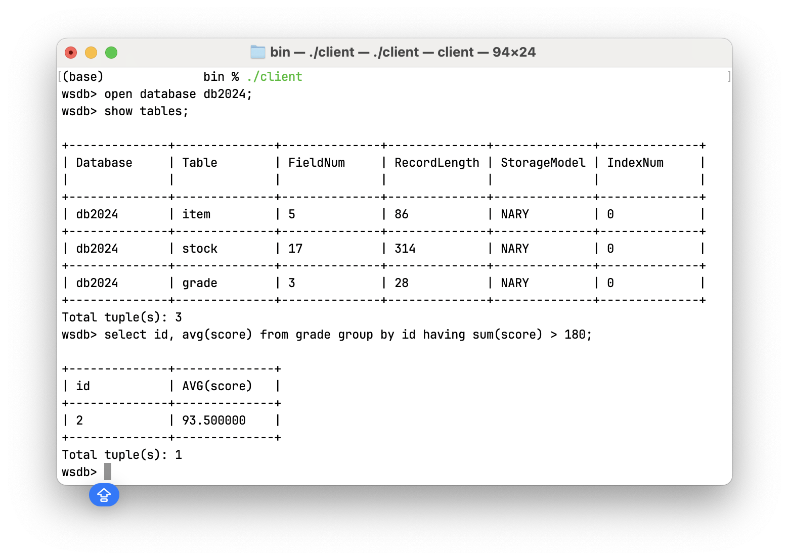
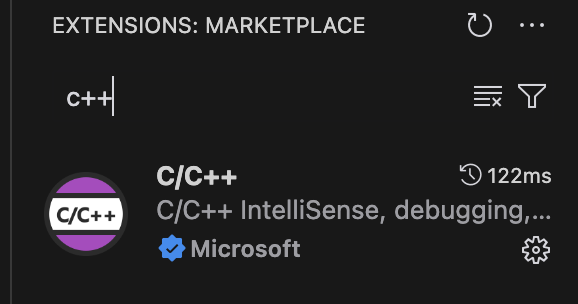
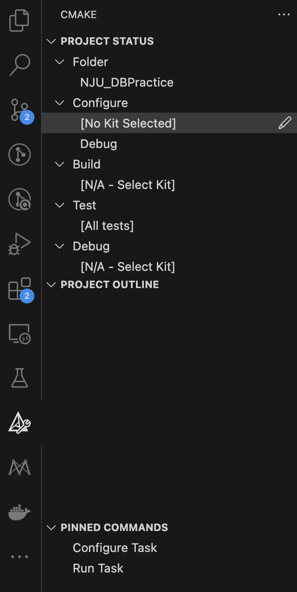
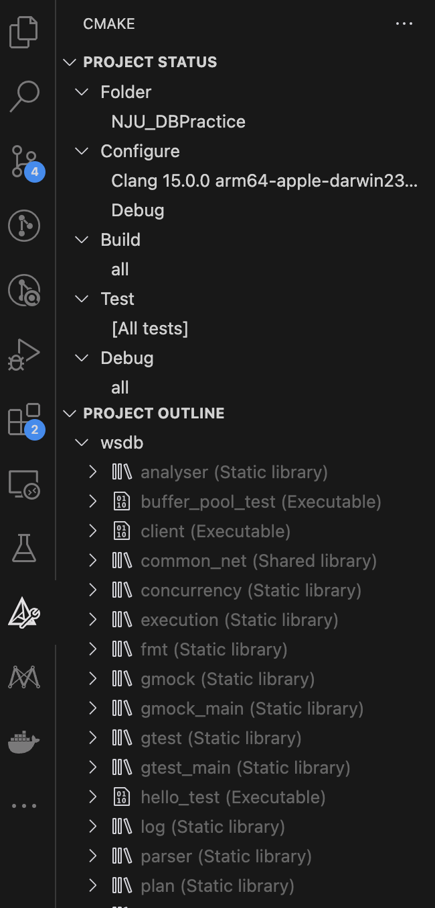
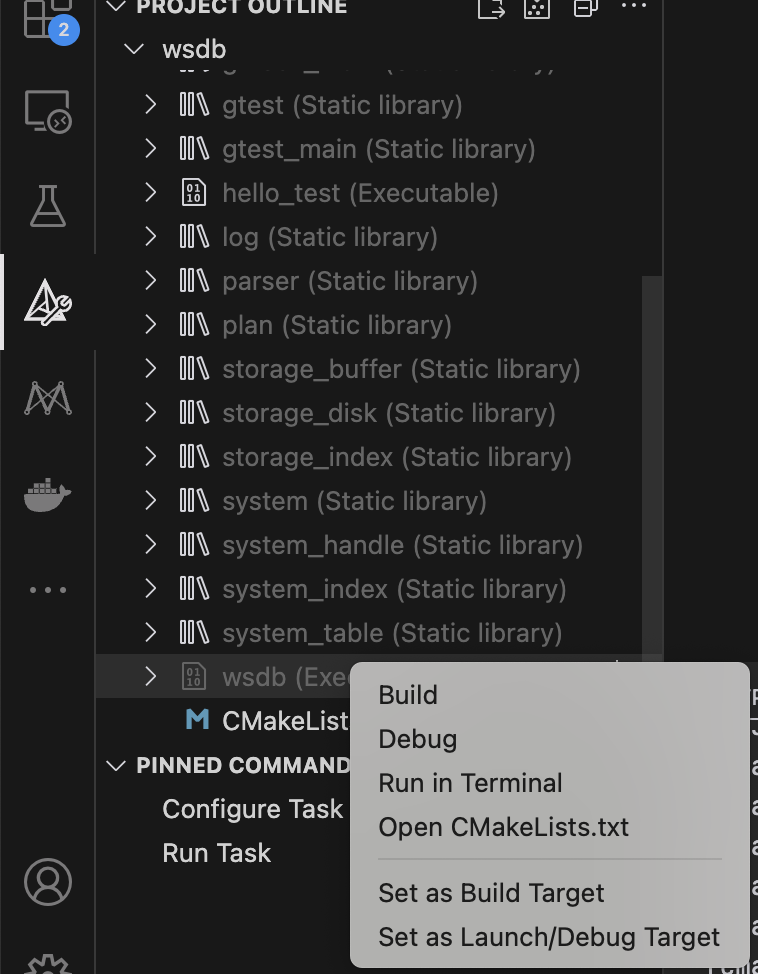
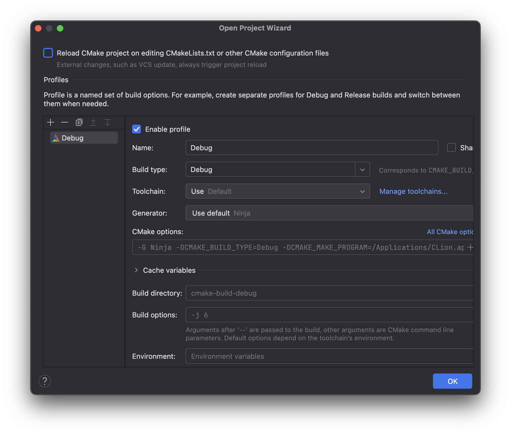
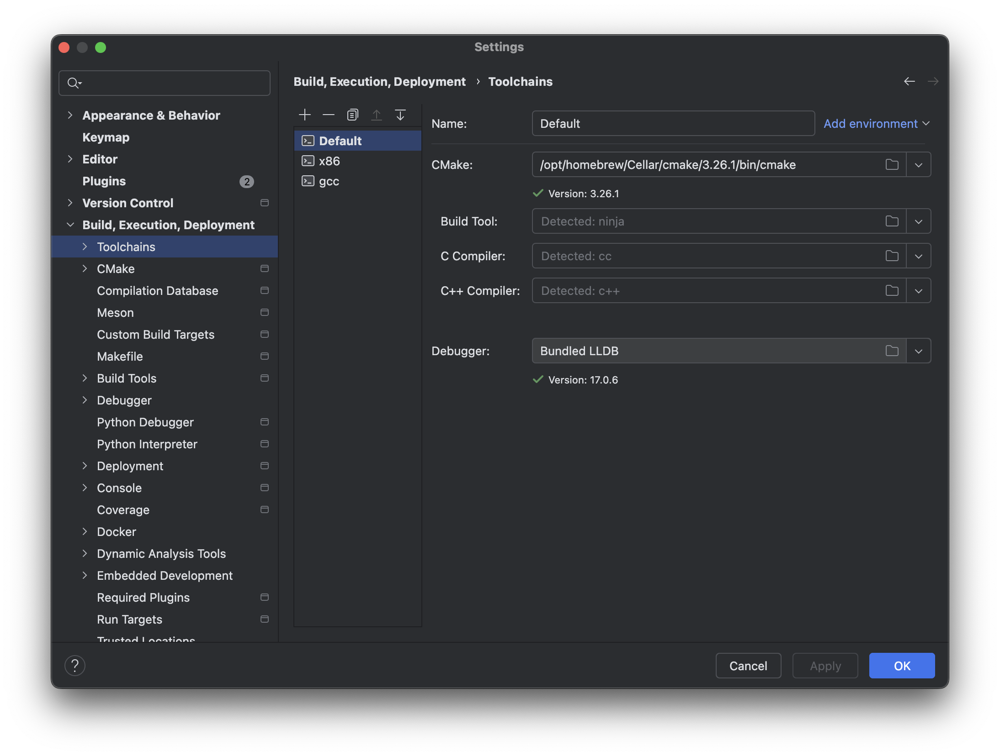
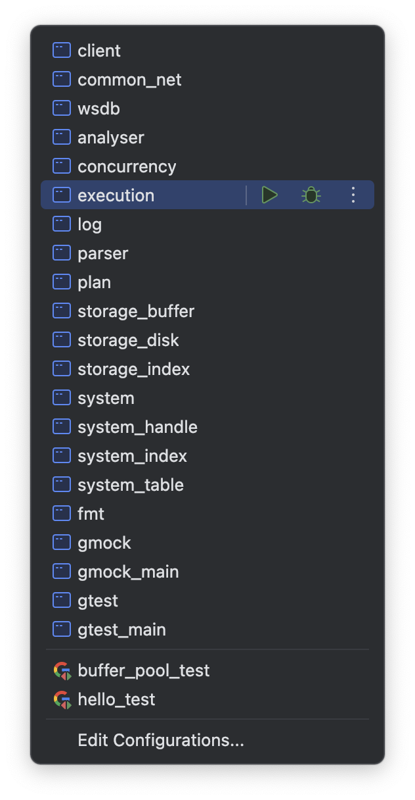
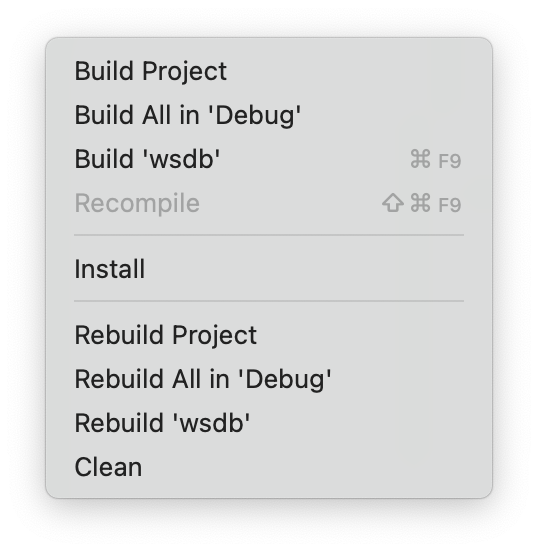

# 开始之前

## C++基础

如果你已经熟练地掌握C++中关于多态，智能指针，右值引用，匿名函数的语法和功能，可以略过这一部分的介绍。如果你不熟悉这些特性，这一节的内容将帮助你流畅阅读代码和完成所有实验。

### 异常检测与互斥锁

C++ 的异常处理机制提供了一种处理运行时错误的结构化方式，确保程序可以从异常中恢复，或者在处理异常时确保程序的资源被正确释放。异常处理主要使用`try`、`throw`和`catch`三个关键字来实现。其中`try`块中放置可能会抛出异常的代码，`throw`用于抛出异常，`catch`捕获异常并处理。

WSDB的异常处理见文件`common/error.h`，首先在宏`WSDB_ERRORS`中定义了各种异常类型，同学们在实验过程中如果遇到了不在`WSDB_ERRORS`列表中的未知异常，请使用`WSDB_EXCEPTION_EMPTY`，并在报告中写下你遇到的特殊情况。

C++提供了一组标准异常类（如std::exception及其派生类）来处理常见的异常情况，WSDB中基于std::exception自定义了异常类`WSDBExecption_`：
```c++
class WSDBException_ : public std::exception
{
public:
  WSDBException_() = delete;
  explicit WSDBException_(WSDBExceptionType type, std::string cname = {}, std::string fname = {}, std::string msg = {})
      : type_(type), cname_(std::move(cname)), fname_(std::move(fname)), msg_(std::move(msg))
  {
    std::string info_str = msg_.empty() ? "" : ": " + msg_;
    out_ = fmt::format("EXCEPTION <{}::{}>[{}]: {}", cname_, fname_, WSDBExceptionTypeToString(type_), info_str);
  }

  WSDBExceptionType type_;   //异常类型
  std::string       cname_;  //异常所在类名
  std::string       fname_;  //异常所在函数名
  std::string       msg_;    //自定义信息
  std::string       out_;    //格式化输出信息

  [[nodiscard]] const char *what() const noexcept override { return out_.c_str(); }

  // dismiss class and function name
  [[nodiscard]] auto short_what() const -> std::string
  {
    return fmt::format("EXCEPTION [{}]: {}", WSDBExceptionTypeToString(type_), msg_);
  }
}
```
下面具体介绍如何利用`WSDBExecption`类进行异常处理，我们提供了异常处理宏以获得更详细的调用信息。以异常`WSDB_FILE_EXISTS`为例，假设其发生在`DiskManager`类的`CreateFile`函数中，那么你可以在需要抛出异常的地方插入语句
```c++
WSDB_THROW(WSDB_FILE_EXISTS, fname);
```
宏展开后为
```c++
throw wsdb::WSDBException_(WSDB_FILE_EXISTS, fmt::format("{}({})", "/path to wsdb/src/storage/disk/disk_manager.cpp", 33), __func__, fname)
```
其中`WSDBException()`的第一个参数是异常类型，第二个参数是可自定义的附加信息，在这里是待创建文件的地址。
更多的辅助调试宏定义请参考`common/error.h`以及`common/micro.h`。我们非常建议充分使用`WSDB_ASSERT`宏来进行一些必要的断言，这能帮助你更快地发现错误。


互斥锁是多线程编程中用于保护共享资源的同步原语。通过互斥锁，保证在同一时刻只有一个线程可以访问某个共享资源，从而防止数据竞争问题。


C++标准库提供了多种类型的互斥锁机制，常用的包括`std::mutex`和基于它的工具类`std::lock_guard`和`std::scoped_lock`，用于确保线程安全的锁和解锁操作。

互斥锁`std::mutex`提供了两种基本操作：
- **lock()**：锁定互斥锁。如果互斥锁已经被另一个线程锁定，则该线程会被阻塞，直到互斥锁被解锁。
- **unlock()**：解锁互斥锁，允许其他被阻塞的线程锁定互斥锁。
```c++
void increment() {
    mtx.lock();
    // 临界区：只有一个线程可以访问此资源
    ++shared_counter;
    mtx.unlock();
}
```
`std::lock_guard`是一个 RAII（资源获取即初始化）的工具类，用于在构造时锁定互斥锁，在作用域结束时自动解锁。这使得我们不必显式调用`lock()`和`unlock()`，减少了手动管理锁的出错风险。
```c++
void increment() {
    std::lock_guard<std::mutex> lock(mtx);  // 自动锁定
    ++shared_counter;  // 访问共享资源
    // 当函数结束时，lock_guard 被析构，自动释放锁
}
```
`std::scoped_lock`是C++17引入的多锁管理工具，它和`std::lock_guard`类似，也基于RAII原则。但`std::scoped_lock`允许同时锁定多个互斥锁，并且可以通过确保多个锁的获取顺序，来避免死锁问题。
```c++
std::mutex mtx1, mtx2;
void foo() {
    std::scoped_lock lock(mtx1, mtx2);  // 同时锁定多个互斥锁
    // 临界区，可安全访问受保护的资源
}
```

### 多态

多态是面向对象编程中一个重要的特性，它允许在继承结构中通过父类的指针或引用调用子类重写的方法，从而实现不同的行为。C++中的多态主要通过虚函数实现。

例如，在WSDB的执行器部分（`src/execution`）中，各种执行器类如`AggregateExecutor`、`FilterExecutor`等均继承自`AbstractExecutor`类，并重写了`AbstractExecutor`类的`Init()`、`Next()`和`IsEnd()`方法。

**注意**：WSDB是单根继承，如果一定要定义多继承关系需要基类为没有成员的虚基类。

`friend`关键字允许某个函数或类访问另一个类的私有成员，`friend`关系是单向的。

例如，在WSDB的`RecordSchema`类（`src/system/handle/record_handle.h`）中，将 `Record` 类声明为 `RecordSchema` 类的友元类。这样 `Record` 类中的成员函数就可以直接访问 `RecordSchema` 类中的私有成员，而不用通过公共的接口函数（如 `GetFields()`）访问，从而避免不必要的函数调用和数据拷贝。

### 智能指针

智能指针是 C++ 标准库中用于自动管理动态分配内存的类，它可以在不需要显式释放资源的情况下自动管理对象的生命周期，避免内存泄漏和悬空指针问题。智能指针的主要类型包括：

- **`std::shared_ptr`**：支持共享所有权的智能指针，多个指针可以指向同一个对象，当最后一个指针离开作用域时，对象才会被释放。
- **`std::unique_ptr`**：独占所有权的智能指针，只有一个指针可以指向对象，不能复制，但可以通过`std::move()`转移所有权。

在`common/micro.h`中，通过宏简化了智能指针类型的定义:
```c++
#define DEFINE_SHARED_PTR(type) using type##Sptr = std::shared_ptr<type>
#define DEFINE_UNIQUE_PTR(type) using type##Uptr = std::unique_ptr<type>
```
这两个宏用于为指定的类`type`定义一个别名，生成该类的 `std::shared_ptr`和`std::unique_ptr`类。
例如，在`src/common/value.h`中

```c++
DEFINE_SHARED_PTR(Value);
```
等价于
```c++
using ValueSptr = std::shared_ptr<Value>;
```
后续可以使用`ValueSptr`来简化`std::shared_ptr<Value>`的声明。
### 右值引用

C++11引入了**右值引用**，首先介绍左值和右值的概念：
- **`左值`**：在内存中有固定存储地址，并且可以出现在赋值操作的左侧的对象，比如变量。
- **`右值`**：临时对象或不具名的值，只能出现在赋值操作的右侧，比如字面量。
右值引用使用`&&`表示，典型语法如下：
```c++
int &&rvalue_ref = 10;  // rvalue_ref 引用了一个右值
```
**移动语义**允许将资源从一个对象转移到另一个对象，而不是进行昂贵的拷贝。它主要依赖于右值引用，右值引用可以在对象传递过程中，避免不必要的深拷贝，节省资源；并且支持移动构造函数和移动赋值操作符的实现。
一个移动构造函数和移动赋值操作符的例子如下：

```c++
class MyClass {
public:
    int *data;
    // 移动构造函数
    MyClass(MyClass &&other) noexcept {
        data = other.data;  // 移动资源
        other.data = nullptr;  // 清空源对象的数据
    }
    // 移动赋值操作符
    MyClass& operator=(MyClass &&other) noexcept {
        if (this != &other) {
            delete[] data;  // 释放已有资源
            data = other.data;  // 移动资源
            other.data = nullptr;
        }
        return *this;
    }
};
```
通过移动构造函数和移动赋值操作符，可以从`other`对象中移动`data`指针的所有权，而不进行拷贝操作。

`std::move`是C++标准库中的一个函数模板，它的作用是将一个左值强制转换为右值引用。通过将左值强制转换为右值引用，可以显式地调用移动构造函数或移动赋值操作符，触发移动语义，从而优化性能。

在`common/micro.h`中，定义了三个宏，分别用于禁用类的拷贝构造函数、赋值操作符以及移动构造函数、移动赋值操作符的使用，目的是防止对象在不合适的情况下被拷贝或移动。具体如下：
```c++
#define DISABLE_COPY_AND_ASSIGN(classname)          \
  classname(const classname &)            = delete; \
  classname &operator=(const classname &) = delete;
```
禁用类的拷贝构造函数和拷贝赋值操作符。
```c++
#define DISABLE_MOVE_AND_ASSIGN(classname)     \
  classname(classname &&)            = delete; \
  classname &operator=(classname &&) = delete;
```
禁用类的移动构造函数和移动赋值操作符。
```c++
#define DISABLE_COPY_MOVE_AND_ASSIGN(classname) \
  DISABLE_COPY_AND_ASSIGN(classname)            \
  DISABLE_MOVE_AND_ASSIGN(classname)
```
禁止对象的拷贝和移动，包括拷贝构造、拷贝赋值、移动构造和移动赋值。
### 匿名函数

<!-- 简单讲讲传参数的注意事项，比如[=]和[&],[a, &b]的区别 -->
匿名函数，即Lambda表达式，是 C++11 引入的一种轻量级函数形式，允许在代码中定义临时的、匿名的函数。它们通常用于需要快速定义一个简单的函数对象的场景，如在算法中传递给`std::for_each`、`std::sort`等标准库函数。

Lambda 表达式的基本语法为：
```
[捕获列表](参数列表) -> 返回类型 { 函数体 }
```
- 捕获列表：定义了如何捕获外部作用域的变量。
- 参数列表：包含传递给 Lambda 函数的参数。
- 返回类型：通常可以省略，编译器会自动推导。
- 函数体：Lambda 表达式的主体部分，包含函数执行的逻辑。

例如：
```c++
auto lambda = [](int x, int y) -> int { return x + y; };
std::cout << lambda(2, 3);  // 输出 5
```
Lambda 表达式的捕获列表用于决定如何访问 Lambda 外部的变量。捕获列表的捕获方式有：
- `[=]`（值捕获）：在 Lambda 表达式内部拷贝外部变量的当前值，之后的修改对外部变量没有影响，类似于函数传参的值传递。
- `[&]`（引用捕获）：在 Lambda 内部通过引用访问外部变量，Lambda 对变量的修改将影响外部的变量，类似于函数传参的引用传递。
- 混合捕获：对某些变量进行值捕获，对其他变量进行引用捕获。例如：
```c++
int a = 10;
int b = 20;
auto lambda = [a, &b]() { return a + b; };  // a 是值捕获，b 是引用捕获
a = 30;
b = 40;
std::cout << lambda();  // 输出 50, 因为 a 捕获时是值（10），而 b 是引用（40）
```

## WSDB系统介绍

WSDB是为南京大学《数据库概论》设计的课程实验，总共包含六个部分：

* 实验一：存储引擎，实现缓冲区管理器和页面管理句柄。
* 实验二：执行器——数据库中的“增删改”，以及基本算子的实现。
* 实验三：执行器——数据库中的“查”，数据分析相关算子（JOIN、AGGREGATE等）的实现。
* 实验四（开发中）：索引管理器以及B+树索引的实现。
* 实验五（开发中）：事务管理器，锁管理器以及并发控制。
* 实验六（开发中）：日志管理与故障恢复。

2024秋季学期只需要完成实验一与实验二。

WSDB的服务端系统架构如下图所示（位于`wsdb_root/src`文件夹下）：


### SQL Engine

SQL 引擎负责提供用户输入的处理接口，其处理流程大致如下：

* 首先通过Net Controller模块与客户端进行序列化交互，接收用户在客户端的输入；
  
* 然后在Parser模块对用户输入的SQL语句进行解析，并在Planner模块生成查询计划，查询计划以树状形式组织；
  
* 最后在Optimizer模块中对查询计划进行逻辑优化和物理优化。
  

### Executor

执行器模块定义了数据库的算子，每个算子负责执行数据库的一个基本操作，算子主要包括：

* 数据定义算子：负责定义数据库结构和对象，例如 CREATE、DROP、DESC 等。
  
* 数据操纵算子：负责操作数据库中的数据，例如 INSERT、UPDATE、DELETE 等。
  
* 事务处理算子：负责管理事务的操作符或机制，例如 BEGIN、COMMIT、ABORT 等。
  
* 其他基本算子：负责执行其他数据库底层操作，例如 SCAN、JOIN、PROJECTION等。
  

### System

系统模块由系统管理器（System Manager）和系统句柄（System Handle）两部分组成。

系统管理器负责数据库系统中一个DB的创建与管理。系统管理器中的组件包括表管理器（TableManager）和索引管理器（Index Manager），分别负责当前DB中表文件和索引文件的维护。

系统句柄是对数据库，表，索引，页面以及元组的抽象，为不同的数据层级提供增删改查的接口。

### Storage

存储模块由缓冲区管理器（Buffer Pool Manager），磁盘管理器（Disk Manager）以及索引存储（Index Storage）组成。

缓冲区管理器负责管理内存中的缓冲区（Buffer Pool），缓冲区是数据库在内存开辟的一块空间，用于缓存数据库存储在磁盘上的数据页面，以减少频繁访问磁盘的开销。缓冲区管理器提供的功能主要是数据页在磁盘和缓冲区之间的读写以及各种页面替换策略（replacer）的实现。

磁盘管理器负责磁盘文件的管理，并且为缓冲区管理器的页面读写提供底层接口。

索引存储负责对索引文件数据结构的定义与物理实现。

### Concurrency&Log

并发和日志模块是维护OLTP数据库ACID原则的重要管理模块，分别由事务管理器，日志与恢复系统，以及组成。

事务管理器负责事务的开始（Begin），提交（Commit）与中止（Abort）并对异常中止的事务进行回滚。

日志管理器通过WAL策略维护“增删改”操作的完整记录以便从系统故障中恢复。

锁管理器管理系统中所有层级上数据结构的锁以保证事务处理的可串行化。

## WSDB客户端介绍

完成实验2后，你可以使用WSDB的客户端对服务器程序进行测试。客户端可以自定义输入文件和输出文件，如果不指定则默认为标准输入输出。在指定输入文件时，客户端进入非交互模式运行，运行完文件中的SQL语句后自动退出。如果不指定输入文件，将进入命令行交互模式。

编译完成后，在`wsdb_root/build/bin`目录下执行指令
```shell
$ ./wsdb
```
启动服务端进程后，在当前目录下再打开一个shell执行指令
```shell
$ ./client
```
启动客户端即可使用命令行与服务器交互。


每次都会统计返回的记录数，结合表格信息能够方便检查服务器可能出现的异常。

```shell
$ ./client -h
```

`-h`查看所有可选参数，当指定输入文件时，客户端进入非交互模式，执行完文件中的所有SQL指令后自动退出

下面通过一些SQL实例带大家熟悉WSDB的客户端操作，按照顺序输入如下内容

```sql
CREATE DATABASE test;
OPEN DATABASE test;
CREATE TABLE t1 (i1 INT, s1 CHAR(10));
CREATE TABLE t2 (i2 INT, s2 CHAR(10));
SHOW TABLES;
```
```sql
wsdb> CREATE DATABASE test;
wsdb> OPEN DATABASE test;
wsdb> CREATE TABLE t1 (i1 INT, s1 CHAR(10));

+--------------+--------------+--------------+--------------+--------------+--------------+
| Database     | Table        | FieldNum     | RecordLength | StorageModel | IndexNum     | 
|              |              |              |              |              |              | 
+--------------+--------------+--------------+--------------+--------------+--------------+
| test         | t1           | 2            | 14           | NARY_MODEL   | 0            | 
+--------------+--------------+--------------+--------------+--------------+--------------+
Total tuple(s): 1
wsdb> CREATE TABLE t2 (i2 INT, s2 CHAR(10));

+--------------+--------------+--------------+--------------+--------------+--------------+
| Database     | Table        | FieldNum     | RecordLength | StorageModel | IndexNum     | 
|              |              |              |              |              |              | 
+--------------+--------------+--------------+--------------+--------------+--------------+
| test         | t2           | 2            | 14           | NARY_MODEL   | 0            | 
+--------------+--------------+--------------+--------------+--------------+--------------+
Total tuple(s): 1
wsdb> SHOW TABLES;

+--------------+--------------+--------------+--------------+--------------+--------------+
| Database     | Table        | FieldNum     | RecordLength | StorageModel | IndexNum     | 
|              |              |              |              |              |              | 
+--------------+--------------+--------------+--------------+--------------+--------------+
| test         | t2           | 2            | 14           | NARY_MODEL   | 0            | 
+--------------+--------------+--------------+--------------+--------------+--------------+
| test         | t1           | 2            | 14           | NARY_MODEL   | 0            | 
+--------------+--------------+--------------+--------------+--------------+--------------+
Total tuple(s): 2
```
你可以看到客户端返回了表格信息，关于字段的含义随着实验的进行会逐渐明了。

```sql
DESC t1;
```
```sql
wsdb> desc t1;

+--------------+--------------+--------------+
| Field        | Type         | Null         | 
+--------------+--------------+--------------+
| i1           | TYPE_INT (4) | YES          | 
|              |              |              | 
+--------------+--------------+--------------+
| s1           | TYPE_STRING  | YES          | 
|              | (10)         |              | 
+--------------+--------------+--------------+
Total tuple(s): 2
```
DESC 语句可以查看表的字段信息，包括字段名、字段类型和是否允许为空。
  
```sql
explain SELECT i1, COUNT(t2.i2) FROM t1 OUTER JOIN t2 WHERE i1=i2 GROUP BY i1 HAVING i1 > 1 AND AVG(i2) > 5 USING SORT_MERGE_JOIN;
```
```sql
wsdb> explain SELECT i1, COUNT(t2.i2) FROM t1 OUTER JOIN t2 WHERE i1=i2 GROUP BY i1 HAVING i1 > 1 AND AVG(i2) > 5 USING SORT_MERGE_JOIN;
---
Logical Plan:
ProjectPlan <#6.i1:TYPE_INT(4), #7.i2:TYPE_INT(4)[COUNT]>
  FilterPlan <#6.i1:TYPE_INT(4) > 1 AND #7.i2:TYPE_INT(4)[AVG] > 5>
    AggregatePlan <group fields: #6.i1:TYPE_INT(4)> <agg fields: #7.i2:TYPE_INT(4)[COUNT], #7.i2:TYPE_INT(4)[AVG]>
      JoinPlan <conds: #6.i1:TYPE_INT(4) = #7.i2:TYPE_INT(4), type: OUTER_JOIN, strategy: SORT_MERGE>
        ScanPlan [t1]
        ScanPlan [t2]
---
Physical Plan:
ProjectPlan <#6.i1:TYPE_INT(4), #7.i2:TYPE_INT(4)[COUNT]>
  FilterPlan <#6.i1:TYPE_INT(4) > 1 AND #7.i2:TYPE_INT(4)[AVG] > 5>
    AggregatePlan <group fields: #6.i1:TYPE_INT(4)> <agg fields: #7.i2:TYPE_INT(4)[COUNT], #7.i2:TYPE_INT(4)[AVG]>
      JoinPlan <conds: #6.i1:TYPE_INT(4) = #7.i2:TYPE_INT(4), type: OUTER_JOIN, strategy: SORT_MERGE>
        SortPlan <#6.i1:TYPE_INT(4)>
          ScanPlan [t1]
        SortPlan <#7.i2:TYPE_INT(4)>
          ScanPlan [t2]
```
explain 语句可以查看查询计划，包括逻辑计划和物理计划。逻辑计划描述了查询的逻辑执行顺序，物理计划描述了查询的物理执行顺序。关于SQL语句如何执行以及查询计划为何是以树形式呈现的，你会在完成实验二和实验三后有更深入的了解。
最后通过`exit；`退出客户端，`Ctrl+C`退出服务端。


## WSDB代码和格式规范

项目根目录下的.clang-tidy文件在配置成功后能够对整个项目进行代码格式化，关于如何使用加载.clang-tidy，请参考你使用的IDE的官方文档或者询问GPT。

除一些第三方软件出现的warning（比如某些版本的bison大概率会出现的yyerror unused的warning可以忽视），同学们提交的代码应尽量做到warning free。

## 致选修这门课的同学们

WSDB仍然处于发展初期，测试不甚完备，希望同学们发现除作业之外的框架代码出现bug后通过github
issue或者课程qq群积极反馈，对于能提供完备bug复现方法或者测试样例的同学我们会给予奖励并加入项目的贡献者列表，同时也非常欢迎对DBMS感兴趣的同学加入到WSDB的后续开发中。为了之后的同学能有愉快的学习体验，请同学们尽量不要将代码答案直接上传到公开平台上，你可以分享自己的解题思路或者优化策略，这对学弟学妹会有更大的帮助。WSDB虽然是一个玩具数据库，但仍然有不小的代码量，我们会努力完善实验手册，争取让大家0基础上手。对于实在无法解决的问题或者实验手册中没覆盖到的你不清楚的知识点，请尽管询问群内大佬或者私信助教。最后祝同学们在WSDB中玩得愉快～～

# 附录：IDE配置

## 如何快速优雅地编译运行WSDB

你可以使用任意你喜欢的Linux发行版或者MacOS系统，按照README中的环境配置教程安装项目依赖的工具。如果你在使用Windows系统，可以使用WSL或者虚拟机来进行开发，我们建议使用图形化的现代IDE对代码进行调试，关于如何使用VSCode或者CLion连接WSL可以参考下面的文章：[VSCode + WSL](https://code.visualstudio.com/docs/remote/wsl)，[CLion + WSL](https://www.jetbrains.com/help/clion/how-to-use-wsl-development-environment-in-product.html#wsl-general)。

## vscode

下面我们介绍如何使用vscode或clion运行和调试代码，前者有更快的索引和打开速度，后者有更丰富的代码提示和错误检测，可根据个人喜好选择合适的开发环境。

### 安装

在插件市场中安装C/C++套件。




### 配置

在configure部分选择支持c++20特性的编译器，如gcc10，clang11等以上版本。



这里我们以clang15为例，配置完成后会在Project Outline中出现需要编译的目标文件。



找到wsdb，右键弹出菜单中即可编译或调试。



## Clion

如果你的机器有足够的内存，我们建议使用Clion作为IDE，会帮助你更好地调试和减少warning。

使用clion打开从github clone下来的仓库文件夹


在弹出窗口中配置Toolchain。



如果没有可用的Toolchain可点击OK后，在Settings->Build, Execution, Deployment->Toolchain中进一步配置cmake，编译器路径等信息。



配置完成后，在右上角选择需要编译的目标文件，其中wsdb为服务器目标，client为客户端目标



或直接在菜单的Build一栏中点击Build All即可编译所有目标




也可直接点击相应按钮来调试或运行。
