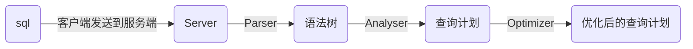
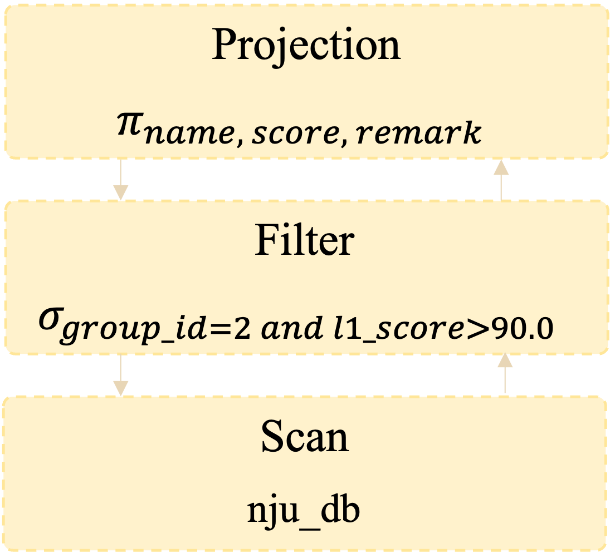

# 实验 2：执行引擎（上）

## 引言

复杂的SQL语句是怎样解析并修改和查询数据库中的数据的？本次实验同学们将完成几个基本的执行器并能够执行如下SQL语句：

```sql
select name, score, remark from nju_db where group_id = 2 and l1_score > 90;  
```

## 数据流

在WSDB中，一条SQL语句的前处理执行流程如下：



后处理执行流程如下：


感兴趣的同学可以查看位于`system/system.cpp`文件的函数`SystemManager::ClientHandler(int client_fd)`对以上流程进行更细致的了解。

本次实验需要同学们实现后处理流程中Executor的内容，理解和掌握火山模型的计算流程。

## 火山模型与算子

火山模型，又叫迭代器模型，是数据库界已经很成熟的解释计算模型，该计算模型将关系代数中每一种操作抽象为一个算子，每个算子有一个`Next`接口，每次调用这个接口将会返回这个算子产生的一行数据（即一个tuple）。将整个 SQL 语句构建成一个算子树，从根节点到叶子结点可以自上而下地递归调用`Next`函数，因此在算子树的根节点迭代地调用`Next`函数就可以获得整个查询的全部结果。

推荐阅读[Volcano— An Extensible and Parallel Query Evaluation System](https://www.computer.org/csdl/journal/tk/1994/01/k0120/13rRUwI5TRe)以对火山模型进行更深入的了解。

对于引言中的例子，其算子树如下图所示：



在WSDB中，每个算子都由`Init`，`Next`，`IsEnd`接口组成，分别用于算子资源的初始化，获取下一条记录，以及判断算子计算是否结束。

要执行上述的算子树，我们只需要将最顶层的算子`exec_tree`传入函数：

```c++
void Executor::Execute(const AbstractExecutorUptr &executor, Context *ctx)
```

这个函数主要负责对算子进行初始化，然后迭代地调用算子的`Next`接口获取下一条记录，直到算子计算全部结束。

```
+----+------+-------+----------+----------+--------+
| id | name | score | group_id | l1_score | remark |
+----+------+-------+----------+----------+--------+
| 1  | n1   | 90    | 2        | 91.5     | r1     |
+----+------+-------+----------+----------+--------+
| 2  | n2   | 83    | 1	       | 89       | r2     |
+----+------+-------+----------+----------+--------+
| 3  | n3   | 97    | 2        | 92       | r3     |
+----+------+-------+----------+----------+--------+
```

回到之前的例子，假如我们有一个三个记录的表，在上述算子树的执行过程中

1. `Projection`需要输出一个记录，则通过下层算子`Filter`的`Next`抽取记录。

2. `Filter`接到记录抽取请求，并继续向下层请求记录。

3. `Scan`作为最底层算子，接受请求，并返回给`Filter`第一条记录，`Filter`经过检查后发现第一条记录满足过滤条件，于是继续将该条记录传递给`Projection`

4. 至此`Projection`的`Next`接口得到了一个记录，通过投影操作向`Executor`返回请求的字段，作为最终结果

   ```
   +-------+-------+--------+
   | n1	| 90	| r1	 |
   +-------+-------+--------+
   ```

5. `Executor`继续通过`Projection`的`Next`接口抽取下一条记录，当`Filter`收到`Scan`返回的记录时发现第二条记录无法通过过滤，于是再次通过`Scan`的`Next`抽取第三条记录，经过检查后发现满足过滤条件，于是返回给`Projection`，并由其完成其余投影操作后将结果返回给`Executor`。

   ```
   +-------+-------+--------+
   | n3	| 97	| r3	 |
   +-------+-------+--------+
   ```

6. `Executor`向`Projection`询问是否还有记录，由于`Projection`是否结束取决于下层的`Filter`是否结束，`Filter`是否结束取决于Scan是否结束，`Scan`发现表中已无更多记录于是将执行结束的信息一步步向上传递，`Executor`收到结束信息后做其余收尾工作。

通过这个例子，你应该已经理解了算子树的构建和基本执行过程，并且也对`ProjectionExecutor`、`FilterExecutor`、`SeqScanExecutor`三个算子接口的实现思路有一定了解。

火山模型的优点是逻辑简单，可以通过简单的算子实现复杂的查询功能。但是缺点也显而易见，即每次获取下一条记录时都需要调用一次`Next`函数，大幅降低了计算速度。因此，向量执行引擎被提出，该模型与列存模型能够很好地兼容，感兴趣的同学可以自行查阅资料了解。

## 实验要求

本次实验需要完成基本算子并通过SQL测试。假设仓库目录名为`wsdb`，服务器代码文件均在`wsdb/src/`目录下。你只需要修改或添加`src`文件夹下的文件，如果遇到不在`WSDB_ERRORS`（`wsdb/common/errors.h`）列表中的未知异常，请使用`WSDB_EXCEPTION_EMPTY`，并在报告中写下你遇到的特殊情况。请完成所有标注`WSDB_STUDENT_TODO`宏的函数，并在完成后将宏删除。

### t1: 基本执行算子（90 pts）

本次实验需要完成除DDL语句（数据描述语句），表连接算子，聚合算子，索引扫描算子以外的其余所有算子的`Init`, `Next`, `IsEnd`函数。包括基本算子和用于增删改的DML语句（数据操作语句），并通过SQL测试。

下面以`execution/executor_ddl.cpp`中`ShowTablesExecutor`为例，介绍火山模型的执行过程。
`ShowTablesExecutor`类定义如下：

```c++
class ShowTablesExecutor : public AbstractExecutor
{
public:
  explicit ShowTablesExecutor(DatabaseHandle *db);
  void Init() override;
  void Next() override;
  [[nodiscard]] auto IsEnd() const -> bool override;
private:
  DatabaseHandle *db_;
private:
  bool   is_end_;
  size_t cursor_;
};
```

`ShowTablesExecutor`的主要成员变量包括：

- `db_`为数据库句柄，用于获取所有表的信息

- `is_end`表示算子是否已输出全部记录

- `cursor_`记录当前输出的记录所在的位置

- 以及继承自`AbstractExecutor`的`record_`用于存放生成的记录

  ```c++
  void ShowTablesExecutor::Next()
  {
  if (is_end_) {
    WSDB_FETAL(ShowTablesExecutor, Next, "ShowTablesExecutor is end");
  }
  auto &tables = db_->GetAllTables();
  if (cursor_ >= tables.size()) {
    is_end_ = true;
    return;
  }
  auto it = tables.begin();
  std::advance(it, cursor_);
  auto tab_hdl = it->second.get();
  auto values  = MakeTableDescValue(db_->GetName(),
      tab_hdl->GetTableName(),
      tab_hdl->GetSchema().GetFieldCount(),
      tab_hdl->GetSchema().GetRecordLength(),
      StorageModelToString(tab_hdl->GetStorageModel()),
      db_->GetIndexNum(tab_hdl->GetTableId()));
  record_      = std::make_unique<Record>(out_schema_.get(), values, INVALID_RID);
  cursor_++;
  }
  ```

  在`ShowTablesExecutor`的`Next`函数中，首先检查 table 信息是否已全部输出，如果没有则根据 cursor_ 位置获取对应的 table 信息，并生成记录，最后递增 cursor_ 。

需要注意的是，DDL语句以及DML中的增删改语句不需要执行`Init`函数，大部分的基本算子（`Basic`）可能都需要在Init期间做一些资源的初始化。

关于`Init`，`Next`，和`IsEnd`的调用顺序，请参考`execution/executor.cpp`中的`Execute`函数。

具体来说，你需要确保以下列表中的接口都已被正确实现，才能够执行如下SQL：

```sql
select name, score, remark from nju_db where group_id = 2 and l1_score > 90 order by desc score, id limit 10; 
```

* `execution/executor_insert.cpp`：插入记录，需要同时插入表格和索引
* `execution/executor_seqscan.cpp`：实现全表扫描
* `execution/executor_limit.cpp`：限制结果集大小
* `execution/executor_projection.cpp`：投影操作
* `execution/executor_delete.cpp`：删除记录，需要同时在表格和索引中删除
* `execution/executor_update.cpp`：更新记录，需要同时更新表格和索引
* `execution/executor_filter.cpp`：过滤掉不符合条件的记录
* `execution/executor_sort.cpp`：内排序，中间结果能全部载入内存，根据给定列模式进行升序或降序排序，目前只需要支持全列降序或全列升序，即不需要支持单列顺序，语法为order by (asc,desc,_) \<column list\>，例如上述示例中的`order by desc score, id`会首先按照score降序排列，对于相等的score再根据id降序排列。

建议阅读代码列表：

* `execution/executor_ddl.cpp`
* `system/handle/record_handle.h`
* `system/handle/index_handle.h`
* `common/value.h`

### 附加实验 f1: 嵌套循环内连接与归并排序（10pts）

`t1`的executor_sort假定排序的中间结果能够全部载入内存。然而在大多数应用场景中，可能需要对大量数据进行排序，并且往往没有足够的内存空间支持内排序。在本次实验中，你需要在前一次实验实现的内排序基础上完成外排序，并额外实现嵌套循环连接的内连接算子，能够执行以下SQL，该SQL会对两张含有1000条记录的表做一次笛卡尔积，并对得到的1000*1000条数据根据i_id和s_i_id排序：

```sql
select i_id, s_i_id from item, stock order by i_id, s_i_id;
```

归并排序是最经典的外部排序算法之一。具体实现上又被称为k路归并排序。具体来说，一个文件为一路，共两组文件。一组文件作为读入文件，另一组文件负责接收当前归并之后的结果。比如有如下一组数列[5,3,4,6,2,6,7,3,0,5,3,1,7,8,2]按照升序进行3路归并排序且内存中可用于排序的缓存大小为2，首先进行准备工作进行初始文件划分。按照读入顺序将排序缓存的数据依次写入3个文件，写完后更换下一个文件继续写。完成后三个文件中数据如下

```
|3,5|3,7|7,8|
```

```
|4,6|0,5|2|
```

```
|2,6|1,3|
```

首先准备下一组文件中的第一个文件，该文件中记录了上述三个文件中的第一列数据的排序结果。维护一个大小等于k的小根堆，从三个文件中将第一个数读出，分别为3,4,2。此时堆中最小数为2，在输出文件中写入2，并在2所在的第三个文件中取出下一个数字6，加入到堆中。此时堆内数字为3，4，6，最小数字为3，在输出文件中再写入数字3，从3所在的第一个文件中读取下一个数字5，加入到堆中。依此类推，直到第一个文件准备完成。

```
|2,3,4,5,6,6|
```

同理，准备第二个文件

```
|0,1,3,3,5,7|
```

第三个文件

```
|2,7,8|
```

这时我们已经将上一组的所有数据做了归并。需要注意，该归并结果没有出现第二列，如果在上一组文件中出现更多列，需要将剩余数据再次从第一个文件开始写入直到上一组文件中的数据全部做了归并。由于本组文件只有一列，因此通过一次归并就得到最终结果：

```
|0,1,2,2,3,3,3,4,5,5,6,6,7,7,8|
```

WSDB中`k=SORT_WAY_NUM`默认为10，一个buffer能够支持的最大记录数为`max_rec_num_=SORT_BUFFER_SIZE/record_length`。相关常量定义见`common/config.h`。

嵌套循环内连接的python伪代码如下：

```python
def nestedloop_join(left, right, condition):
    res = []
    for t1 in left:
        for t2 in right:
            j = t1.join(t2)
            if(condition.eval(j)):
                res.append(j)
    return res
```

## 作业评分与提交

### 评分标准

1. 实验报告（10%）：实现思路，优化技巧，实验结果，对框架代码和实验的建议，以及在报告中出现的思考等，请尽量避免直接粘贴代码，建议2-4页。

2. 功能分数（90%）：需要通过`wsdb/test/sql`目录下的SQL语句测试。

    * t1: <u>**顺序**</u>通过`wsdb/test/sql/lab02/t1`下的SQL测试并与`expected`输出比较，无差异获得该小题满分，测试文件分值分别为

        * `01_prepare_table_dbcourse.sql`: 15 pts
        * `02_seqscan_limit_projection.sql`: 30 pts
        * `03_filter_update_delete.sql`: 30 pts
        * `04_sort_final.sql`: 15 pts

    * f1: <u>**顺序**</u>通过`wsdb/test/sql/lab02/f1`下的SQL测试，请先解压`expected.tar.gz`。（提示，该测试需要的时间可能较长，如若20分钟之内不能得到测试结果，可能是实现不够高效或实现有误）

        * `04_merge_sort.sql`: 10pts

    * 提示：你可以cd到`wsdb/test/sql/lab02`目录下通过脚本`evaluate.sh`进行测试，也可以使用终端的命令行工具逐个文件测试或使用交互模式逐个命令测试，**注意：脚本并不负责项目的编译，所以请在运行脚本之前手动编译。**

      ```bash
      $ bash evaluate.sh <bin directory> <test sql directory>
      # e.g. bash evaluate.sh /path/to/wsdb/cmake-build-debug/bin t1
      ```

**重要：请勿尝试抄袭代码或搬运他人实验结果，我们会严格审查，如被发现将取消大实验分数，情节严重可能会对课程总评产生影响!!!**

3. 测试方法：编译`wsdb`，`client`，`cd`到可执行文件目录下并启动两个终端分别执行：
   
   ```shell
   $ ./wsdb
   $ ./client
   ```
   
   关于client的更多用法可参考00basic.md或使用-h参数查看。如果`wsdb`因为端口监听异常启动失败（通常原因是已经启用了一个wsdb进程或前一次启动进程未正常退出导致端口未释放），需要手动杀死进程或者等待一段时间wsdb释放资源后再重新启动。

### 提交材料

1. 实验报告（提交一份PDF，命名格式：lab2\_学号\_姓名.pdf）：请在报告开头写上相关信息。
   
   | 学号     | 姓名 | 邮箱                      | 完成题目 |
      | -------- | ---- | ------------------------- | -------- |
   | 12345678 | 张三 | zhangsan@smail.nju.edu.cn | t1/f1    |

2. 代码：`wsdb/src`文件夹

*提交示例：请将以上两部分内容打包并命名为lab2\_学号\_姓名.zip（例如lab2_123456_张三.zip）并上传至提交平台，请确保解压后目录树如下：*

```
├── lab2_123456_张三.pdf
└── src
 ├── CMakeLists.txt
 ├── common
 ├── concurrency
 ├── execution
 ├── expr
 ├── log
 ├── main.cpp
 ├── net
 ├── optimizer
 ├── parser
 ├── plan
 ├── storage
 └── system
```
